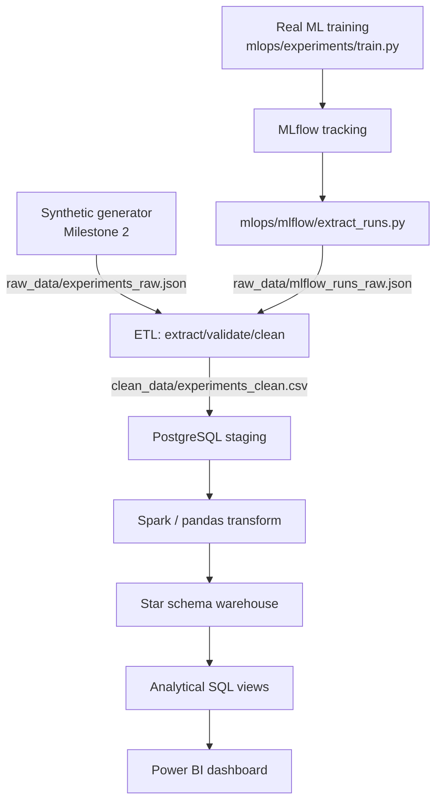

# AI Model Insight Platform

A production-inspired Data Engineering / MLOps portfolio project that monitors, analyzes,
and visualizes metadata generated during AI training experiments — inspired by the internal
analytics platforms used at organizations like OpenAI, Google DeepMind, NVIDIA, Meta AI,
Anthropic, and Hugging Face.

Instead of storing datasets or model weights, this platform stores and analyzes
**experiment metadata**: hyperparameters, hardware utilization, training/inference
performance, and success/failure outcomes — for both large synthetic experiment
histories *and* real PyTorch training runs tracked in MLflow.

## Status

✅ Milestones 1-7 complete. Milestone 7 (Real ML Experiment Tracking & MLOps
Integration) evolved the platform from a synthetic-data-only warehouse into
one that also ingests real, MLflow-tracked ML experiments through the same
ETL/warehouse pipeline.

## Scope

- Synthetic experiment log generator (Faker) — Milestone 2
- **Real ML experiments**: a config-driven PyTorch CNN trained on CIFAR-10
  (or a same-shaped offline fallback dataset), with full MLflow experiment
  tracking (params, metrics, system metadata, artifacts) — Milestone 7
- Python ETL pipeline (extract, validate, clean) — shared by both synthetic
  and MLflow-sourced data
- PostgreSQL staging layer
- Apache Spark transformations
- Star Schema data warehouse
- Analytical SQL (views, indexes, CTEs, window functions), including a
  synthetic-vs-real source breakdown view
- Power BI executive dashboard
- Full documentation (architecture, ER diagram, star schema diagram)

## Architecture



## Folder Structure

```
AI_Model_Insight_Platform/
├── docs/                # Architecture, ER, star schema diagrams, roadmap
├── generator/            # Synthetic experiment data generator (Milestone 2)
├── mlops/                # Milestone 7: real ML experiments + MLflow
│   ├── experiments/      #   config-driven PyTorch training (train.py, model.py, data.py)
│   │   └── configs/      #   experiments/configs/*.yaml — one file per experiment
│   ├── mlflow/            #   tracking.py (init + system metadata), extract_runs.py
│   └── pipeline/           #   run_mlops_pipeline.py — end-to-end orchestration
├── etl/                   # Extract, validate, clean pipeline (shared by all sources)
├── database/               # Schemas, staging models, DB access
├── spark/                    # Spark transformation jobs
├── warehouse/                 # Star schema DDL + load scripts + analytics.sql
├── dashboard/                  # Power BI assets
├── config/                      # config.yaml + config_loader.py
├── tests/                        # pytest unit/integration tests
├── models/                        # MLflow run checkpoints (gitignored, generated)
├── logs/                           # Pipeline logs
├── raw_data/                       # Raw generated + MLflow-extracted experiment logs
├── clean_data/                      # Cleaned data + Parquet exports
├── requirements.txt
└── README.md
```

## Roadmap

See `docs/roadmap.md` for the full milestone-by-milestone plan (project foundation
through real ML experiment tracking, with orchestration/containerization/cloud
deployment/streaming as future milestones).

## Setup

```bash
python -m venv venv
source venv/bin/activate
pip install -r requirements.txt
```

Database credentials are supplied via environment variable (`DB_PASSWORD`), never
committed to `config.yaml`. MLflow's tracking URI defaults to a local SQLite file
(`config["mlops"]["tracking_uri"]`, no server required) but can be overridden per
machine/environment with `MLFLOW_TRACKING_URI` without editing the config file.

## Milestone 7: Real ML Experiments + MLflow

Run one experiment:

```bash
python -m mlops.experiments.train --config mlops/experiments/configs/exp01_baseline.yaml
```

Run the full experiment matrix, extract MLflow metadata, and push it through the
existing ETL → staging → warehouse pipeline in one command:

```bash
python -m mlops.pipeline.run_mlops_pipeline
```

Or step by step, reusing each existing Milestone 3-5 entry point directly:

```bash
# 1. Train every config in mlops/experiments/configs/
python -m mlops.experiments.train --config mlops/experiments/configs/exp01_baseline.yaml
python -m mlops.experiments.train --config mlops/experiments/configs/exp02_high_lr.yaml
# ...(exp03-exp06)

# 2. Extract MLflow run metadata -> raw_data/mlflow_runs_raw.json
python -m mlops.mlflow.extract_runs

# 3. Run the existing ETL, merging synthetic + MLflow raw sources
python -m etl.run_etl --include-mlflow

# 4. Load into PostgreSQL staging, then rebuild the warehouse (unchanged entry points)
python -m database.load_staging
python -m warehouse.build_dim_date
python -m warehouse.transform_load

# 5. Query it (existing analytics layer, plus the new source-breakdown view)
psql -d ai_model_insight -c "SELECT * FROM warehouse.vw_experiment_source_breakdown;"
```

Inspect the MLflow UI locally with `mlflow ui --backend-store-uri sqlite:///mlflow.db`.

Run the test suite (no GPU or live database required for most tests):

```bash
pytest tests/ -v
```

